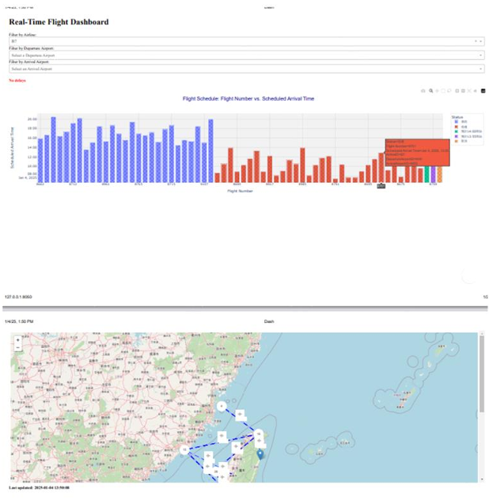

# Real-Time Flight Dashboard

[](#) [](#) [](#license)

## Description

A real-time flight analytics dashboard built with Dash and Folium, featuring interactive charts and map visualizations. It fetches live arrival information from the Taiwan TDX API, supports filtering by airline and airports, and optionally sends delay notifications via email.

### Key Features
- Real-time flight arrivals from the TDX API
- Filters for airline, departure, and arrival airports
- Interactive Plotly visualizations
- Folium map with animated flight paths
- Delay detection with optional email alerts
- Simple CSV caching for faster reloads
- Environment-based configuration with validation

## Installation

### Prerequisites
- Python `3.10+`
- A TDX API account (Client ID and Client Secret)

### Setup
1. Clone the repository
   ```bash
   git clone https://github.com/your-username/real-time-flight-dashboard.git
   cd real-time-flight-dashboard
   ```
2. Create and activate a virtual environment (recommended)
   ```bash
   # Windows (PowerShell)
   py -m venv .venv
   .\.venv\Scripts\Activate.ps1

   # macOS/Linux
   python3 -m venv .venv
   source .venv/bin/activate
   ```
3. Install dependencies
   ```bash
   pip install dash pandas requests folium plotly apscheduler streamlit
   ```
4. Configure environment variables
   - Create a `.env` file at the project root with the following content:
   ```env
   # TDX API credentials (REQUIRED)
   TDX_APP_ID=your_client_id
   TDX_APP_KEY=your_client_secret

   # Optional: override endpoints
   TDX_AUTH_URL=https://tdx.transportdata.tw/auth/realms/TDXConnect/protocol/openid-connect/token
   TDX_API_URL=https://tdx.transportdata.tw/api/basic/v2/Air/FIDS/Airport/Arrival?%24top=200&%24format=JSON

   # App behavior
   REFRESH_INTERVAL=60
   CACHE_FILE=flight_data_cache.csv

   # Email notifications
   ENABLE_EMAIL_NOTIFICATIONS=false
   SMTP_HOST=smtp.gmail.com
   SMTP_PORT=587
   SMTP_USERNAME=your_email@example.com
   SMTP_PASSWORD=your_app_password
   SMTP_FROM=your_email@example.com
   SMTP_TO=recipient@example.com
   ```

### Configuration Notes
- Configuration is centralized in `config.py`. Required variables are validated at startup.
- When `ENABLE_EMAIL_NOTIFICATIONS=true`, SMTP variables must be set.
- For Gmail, use an app password (not your account password).

## Usage

### Run the Dash dashboard
```bash
python Project-0-0-3.py
```
- Opens a local server (default: `http://127.0.0.1:8050/`)
- Features include filter controls, flight delay alerts, bar charts, and a map iframe.

### Run the Streamlit dashboard (optional alternative)
```bash
python Project-0-0-4.py
```
- Displays real-time data, historical trends, and delay analysis in a Streamlit UI.

### Common Operations
- Update environment variables: edit `.env` and restart the app
- Clear cache: delete `flight_data_cache.csv`
- Toggle email notifications: set `ENABLE_EMAIL_NOTIFICATIONS` to `true`/`false`

### Screenshots
```markdown

```

## Contributing

We welcome contributions! Please follow these guidelines:

### Code Style
- Follow PEP 8 for Python code style
- Use descriptive names and docstrings where appropriate
- Keep configuration out of source files; use environment variables via `config.py`

### Development Workflow
1. Fork the repository and create a feature branch
2. Make changes with clear, atomic commits
3. Ensure the app runs locally and configuration validation passes
4. Open a pull request describing your changes and testing steps

### Pull Request Checklist
- Updated docs where necessary
- No hardcoded secrets in source files
- Tested locally with a `.env` file

## License

This project is licensed under the MIT License. See the [LICENSE](LICENSE) file for details.

## Resources
- TDX API: https://tdx.transportdata.tw/
- Dash: https://dash.plotly.com/
- Plotly: https://plotly.com/python/
- Folium: https://python-visualization.github.io/folium/
- Streamlit: https://streamlit.io/

## Maintainers
- Vincent
- Contributions from the community are appreciated!
